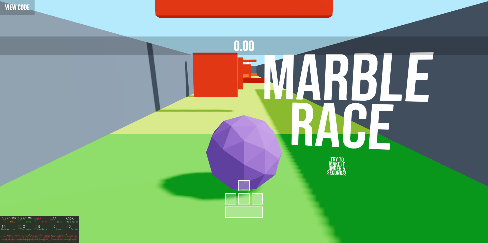

<h1 align="center">
  <br>
    Mini-game with React Three Fiber
  <br>
</h1>

<h4 align="center">
  Built with 
  <a href="https://reactjs.org/">React</a>, React Three Fiber and <a href="https://vitejs.dev/">Vite</a>.
</h4>

<p align="center">
  • <a href="#deployed">Deployed</a> •
  • <a href="#image">Images</a> •
  <a href="#setup">Setup</a> •
  <a href="#dependencies">Dependencies</a> •
</p>

## Deployed

[](https://app.netlify.com/sites/jd-marble-race/deploys)
[Link to the Website](https://jd-marble-race.netlify.app/)

## Images



## Setup

1. Clone the repository

```sh
git clone https://github.com/jsnmarkd/r3f-minigame.git
```

2. Navigate to the project directory

```sh
cd r3f-minigame
```

3. Install the dependencies

```sh
npm install
```

4. Start the server

```sh
npm start
```

## Dependencies

- [React](https://reactjs.org/)
- [React Three Fiber](https://docs.pmnd.rs/react-three-fiber/getting-started/introduction)
- [React Three Drei](https://www.npmjs.com/package/@react-three/drei)
- [React Three Rapier](https://www.npmjs.com/package/@react-three/rapier)
- [r3f-perf](https://www.npmjs.com/package/r3f-perf)
- [Three JS](https://threejs.org/)
- [Zustand](https://www.npmjs.com/package/@react-three/rapier)
